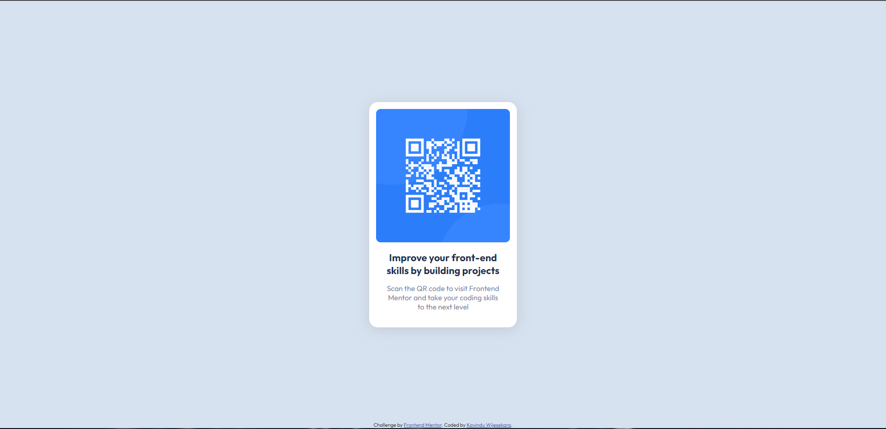

# Frontend Mentor - QR code component solution

This is a solution to the [QR code component challenge on Frontend Mentor](https://www.frontendmentor.io/challenges/qr-code-component-iux_sIO_H). Frontend Mentor challenges help you improve your coding skills by building realistic projects. 

## Table of contents

- [Overview](#overview)
  - [Screenshot](#screenshot)
  - [Links](#links)
- [My process](#my-process)
  - [Built with](#built-with)
  - [What I learned](#what-i-learned)
- [Author](#author)

## Overview

### Screenshot



### Links

- Solution URL: [Click here to see solution](https://www.frontendmentor.io/solutions/qr-code-component-DT2TCD-UOi)
- Live Site URL: [Click here to preview the website](https://ktmogo.github.io/QR-code-component-solution/)

## My process

### Built with

- Semantic HTML5 markup
- CSS custom properties
- Flexbox

### What I learned

```css
@import url('https://fonts.googleapis.com/css2?family=Outfit:wght@400;700&display=swap');
body {
    background-color: var(--lightgray);
    display: flex;
    justify-content: center;
    align-items: center;
    min-height: 100vh;
    font-family: "Outfit", sans-serif;
}
```

## Author

- Frontend Mentor - [@KtMoGo](https://www.frontendmentor.io/profile/KtMoGo)
- Twitter - [@KavinduT8456](https://twitter.com/KavinduT8456)

